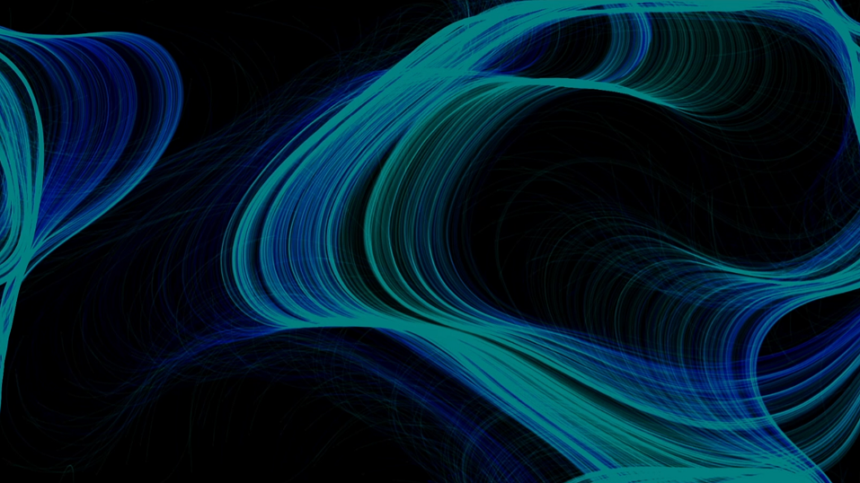
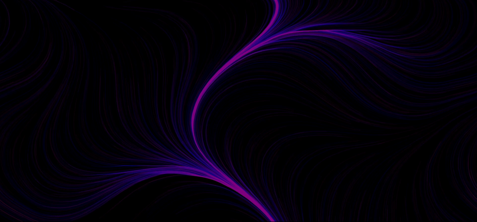

# Perlin Noise Flow Fields

Inspired by this awesome video https://youtu.be/na7LuZsW2UM?si=Fyt31eKT_KfGDFkY 

I tried creating my own visuals by letting Perlin noise decide the directions in a flow field. 

Two of many possible results: 

 
